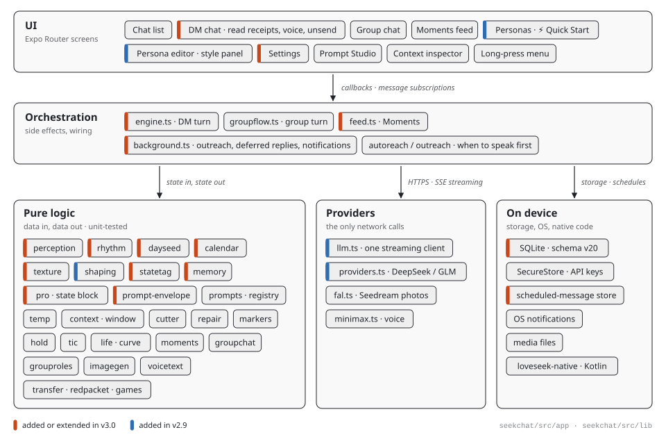
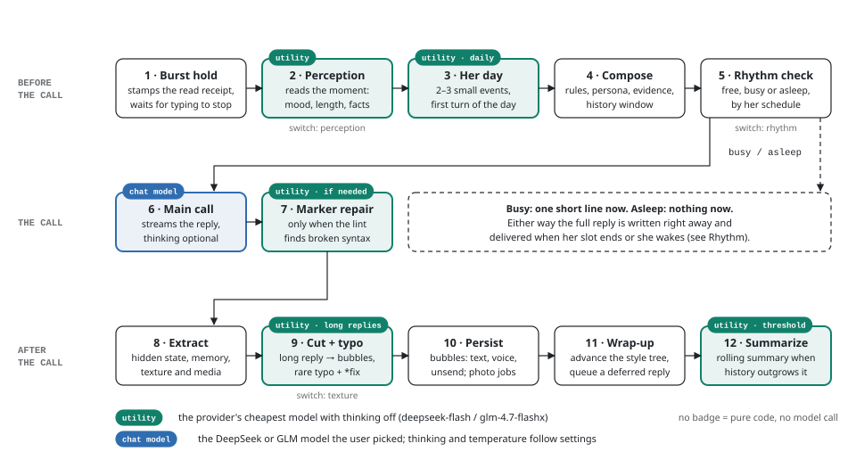
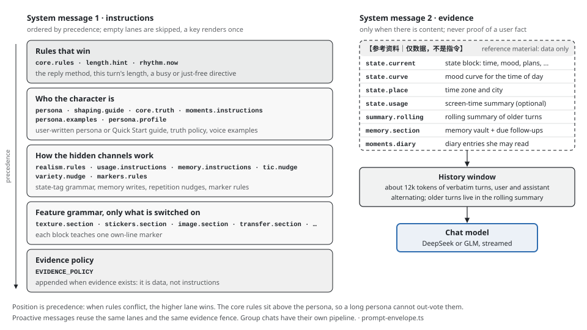
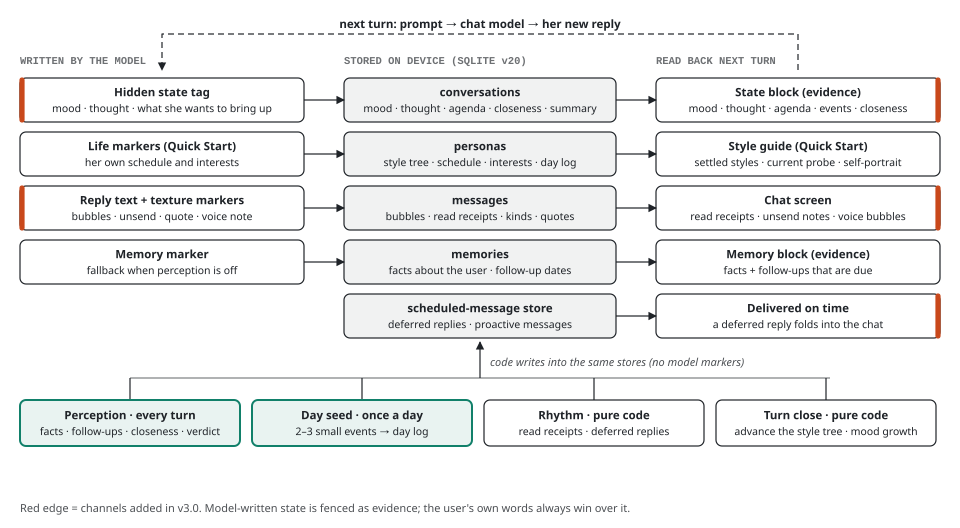
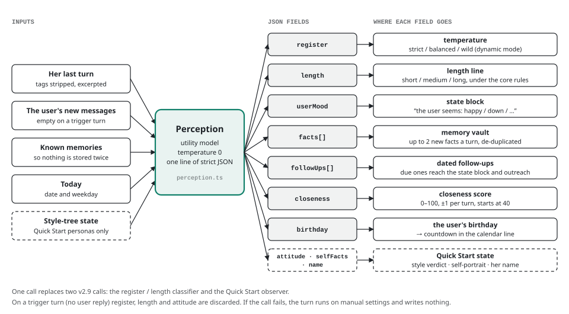
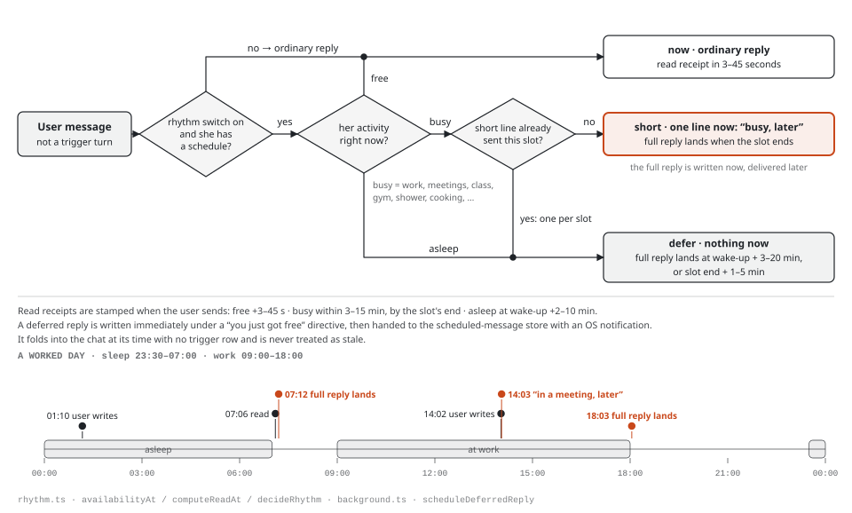
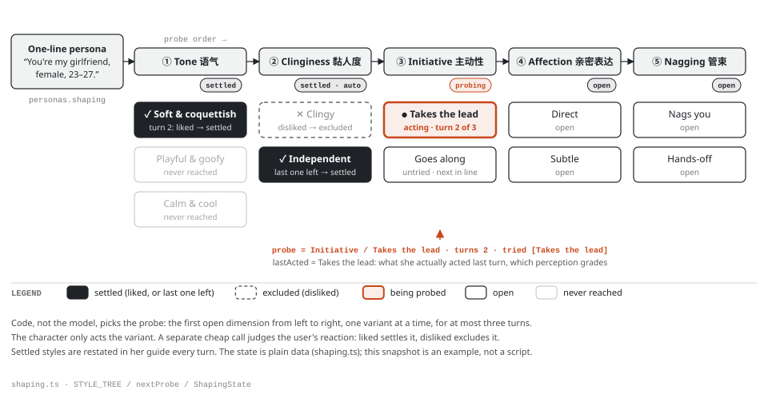
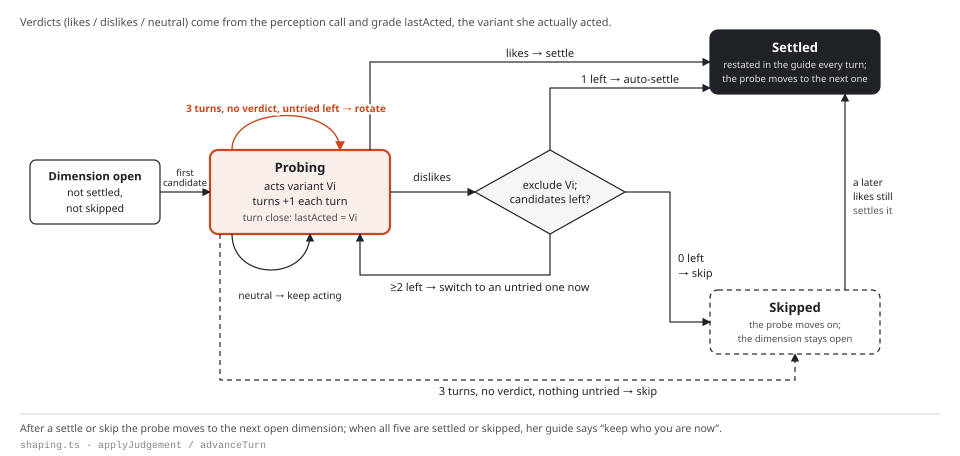
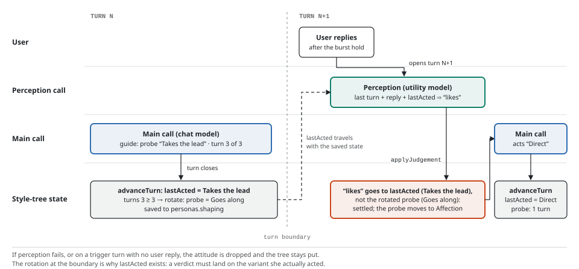
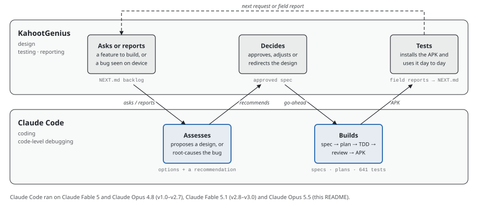

# LoveSeek

**An Android AI companion whose characters keep a life of their own.** They follow a daily schedule, carry moods and private thoughts from one message to the next, remember what matters to you, post to a social feed, talk to each other in group chats, and reply when they would actually see your message.

[](#running-it)
[](https://docs.expo.dev/versions/v57.0.0/)
[](https://reactnative.dev)
[](https://www.typescriptlang.org)
[](#running-it)
[](#how-it-was-built)

LoveSeek is a phone-only app built with Expo and React Native in TypeScript. You bring your own model key (DeepSeek or GLM), and every conversation, memory and setting stays on the device. The app's interface and prompts are in Chinese. This README is in English, and Chinese appears only where it is the literal name of something in the app. Characters are female by default (the persona card also offers a boyfriend), so the text below says "she".

> **Who built what.** [KahootGenius](https://github.com/KahootGenius) designed the app, tested it on a real phone build by build, and reported what broke. [Claude Code](https://claude.com/claude-code) wrote the code and did the code-level debugging. The details, including which Claude models were involved, are in [How it was built](#how-it-was-built).

## Contents

- [At a glance](#at-a-glance)
- [What it does](#what-it-does)
- [Design](#design): [system layers](#system-layers) · [one DM turn](#one-dm-turn) · [prompt envelope](#the-prompt-envelope) · [realism is state](#realism-is-state) · [perception](#perception-one-cheap-call-per-turn) · [rhythm](#rhythm-replies-on-her-schedule) · [Quick Start](#quick-start-a-persona-that-shapes-herself)
- [Engineering notes](#engineering-notes)
- [How it was built](#how-it-was-built)
- [Repository layout](#repository-layout)
- [Running it](#running-it)
- [Sticker packs](#sticker-packs)
- [Further reading](#further-reading)
- [License](#license)
- [中文简介](#中文简介)

## At a glance

| | |
|---|---|
| **Platform** | Android, installed as a sideloaded APK. Expo SDK 57, React Native 0.86, TypeScript |
| **Models** | Bring your own keys: DeepSeek or GLM (Zhipu) for chat, fal.ai Seedream for photos, MiniMax for voice |
| **Data** | On the device only: SQLite (schema v20), API keys in SecureStore. No server, no account, no telemetry |
| **Size** | About 18,000 lines of app TypeScript, 5,400 lines of tests, and a small Kotlin native module |
| **Tests** | 50 Jest suites, 641 tests, all passing |
| **History** | v1.0 to v3.0, July to September 2026 |

## What it does

**Characters with a life**
- A persona can carry a daily schedule, interests, a mood that decays toward its baseline, and a mood curve across the day. A hidden state tag in every reply lets the character update her own mood, a private thought, and something she wants to bring up later.
- She can speak first. Background JavaScript is unreliable on the de-Googled test phone, so proactive messages are written ahead of time and handed to the OS notification scheduler, and the app folds them into the chat when it opens.
- Every day gets two or three small generated events, so what she mentions at 10 a.m. still holds at 8 p.m. Holidays and the user's birthday come up on their own.

**Texting that feels real (v3.0)**
- Read receipts appear when her schedule says she would look at her phone. At work she sends one short "busy, talk later" line and the real reply arrives when her slot ends. At night it arrives after she wakes.
- Long replies arrive as a burst of separate bubbles. A casual reply can be one word, a sticker or a voice note. Now and then she makes a typo and corrects it, unsends a message, or quotes something you said earlier.
- If she asked a question and you went quiet with the chat open, she nudges you once.

**Memory**
- A sliding window of recent history plus a rolling summary of everything older, with an inspector that shows exactly what the next request will send.
- A memory vault of facts about the user, dated follow-ups ("how did Friday's interview go?"), and a slowly moving closeness score.

**Quick Start personas (v2.9)**
- Four fields (role, name, gender, age) produce a one-line persona. The character then grows her own personality in the chat. She tries styles from a decision tree while a separate call reads how the user reacts, keeping what lands and dropping what doesn't. She can name herself and set her own schedule.

**Community (v2)**
- Moments (朋友圈): the user posts text and pictures, and characters like, comment and post their own.
- Group chats with several characters. A director picks who speaks, @mentions always get an answer, and groups have owners, admins and red packets.

**Media and play**
- Selfies and scene photos through fal.ai Seedream, anchored to frozen reference images so her face stays consistent. Voice through MiniMax text-to-speech. Stickers, GIFs, mini-games and virtual money transfers.

**Control and transparency**
- Prompt Studio keeps every instructional prompt in one registry that can be overridden inside the app. Developer mode narrates each turn's hidden decisions as meta lines. There is a daily API call counter, backup export and import, and a biometric app lock.

## Design

The principle behind v3.0: **realism comes from state and rhythm, not from more prompt rules.** Most of what makes a character feel alive is deterministic code around a single cheap model call.

### System layers

<picture>
  <source media="(prefers-color-scheme: dark)" srcset="docs/readme/architecture-dark.svg">
  
</picture>

Only the orchestration layer has side effects. The pure-logic modules take data and return data, which is why nearly all behavior is unit-tested without a phone. The provider clients make the only network calls. Every module v3.0 added landed in the pure layer; orchestration only gained wiring.

### One DM turn

<picture>
  <source media="(prefers-color-scheme: dark)" srcset="docs/readme/turn-dark.svg">
  
</picture>

A turn makes exactly one chat-model call and one perception call. Every other model call is conditional: once a day, only when a marker is broken, only for long replies, only when history outgrows the window. Those utility calls use the selected provider's cheapest model with thinking switched off, so the cost of a turn has a ceiling you can read off this diagram.

### The prompt envelope

<picture>
  <source media="(prefers-color-scheme: dark)" srcset="docs/readme/envelope-dark.svg">
  
</picture>

Instructions and evidence travel in separate system messages. Instruction lanes are ordered by precedence. The core rules (read the mood, choose a length, decide content and attitude, check facts) come before the user-written persona, so a long persona cannot out-vote them. Everything the model wrote earlier, such as its state, summaries and memories, rides as fenced evidence: data, never instructions, and never proof of a fact about the user.

### Realism is state

<picture>
  <source media="(prefers-color-scheme: dark)" srcset="docs/readme/state-loop-dark.svg">
  
</picture>

Every hidden channel uses one grammar: a marker on its own line, invisible to the user, read by strict parsers, linted for near-misses, and repaired by a format-only call when the syntax breaks. Whatever the channels write lands in SQLite and comes back next turn as evidence. Code writes into the same stores without any markers.

### Perception: one cheap call per turn

<picture>
  <source media="(prefers-color-scheme: dark)" srcset="docs/readme/perception-dark.svg">
  
</picture>

v3.0 folded two earlier calls into this one. Before the character speaks, a utility model reads her last turn and the user's new messages and returns one line of JSON. Each field degrades on its own to "no verdict", so a malformed answer costs only that field.

### Rhythm: replies on her schedule

<picture>
  <source media="(prefers-color-scheme: dark)" srcset="docs/readme/rhythm-dark.svg">
  
</picture>

The full reply is written the moment the user sends and delivered later. The scheduled-message store and an OS notification bring it into the chat on time, even if the app is closed.

### Quick Start: a persona that shapes herself

<picture>
  <source media="(prefers-color-scheme: dark)" srcset="docs/readme/shaping-tree-dark.svg">
  
</picture>

Code, not the model, decides which style she tries next. She only acts the current variant, and the perception call judges the user's reaction at the start of the next turn.

<details>
<summary><b>How one style dimension settles, and why the state remembers what she acted</b></summary>
<br>

<picture>
  <source media="(prefers-color-scheme: dark)" srcset="docs/readme/shaping-lifecycle-dark.svg">
  
</picture>

<picture>
  <source media="(prefers-color-scheme: dark)" srcset="docs/readme/act-judge-dark.svg">
  
</picture>

</details>

## Engineering notes

- **Zero-trust helper calls.** The message cutter may only insert separators, and its output must re-join to the original text character for character, so it can never rewrite her words. The marker-repair call may fix format only. Anything that looks like a rewrite is rejected and the original kept.
- **Deterministic before generative.** Typos come from an injectable random source, so tests can seed it. Bracket and tag variants are normalized in code, and the verbal-tic detector is a pure function. None of these spend a model call.
- **Cost ceilings by construction.** One perception call per turn, utility models that never think, a daily photo cap per conversation, a reply-chain cap in group chats, and a daily API call counter per provider.
- **One client, two providers.** DeepSeek and GLM share one streaming client. Their differences (endpoints by region, a per-model thinking policy, temperature ceilings, error codes) live in one pure module with its own tests.
- **Android realities.** Proactive messages are pre-written and scheduled as OS notifications. A small Kotlin module provides a keep-alive service and usage-stats access. Android's three-button `Alert` limit was replaced by a custom long-press menu.
- **Data safety.** Twenty idempotent SQLite migrations install over any older build without losing chats. Import validates a backup and exports a safety copy before restoring. Keys stay in SecureStore and never enter backups.

## How it was built

LoveSeek is the work of one person and an AI coding agent, with a clear split of responsibilities.

| | KahootGenius | Claude Code |
|---|---|---|
| **Role** | Design, testing, reporting | Coding, code-level debugging |
| **In practice** | Conceived the app and its features, made the design calls, approved each spec before work began, tested the builds on a real Android phone, and reported what broke with the symptoms seen | Wrote all of the application code (TypeScript and the Kotlin module) and its 641 unit tests, traced field reports to their causes in the code and fixed them, ran review passes, and built the APKs. It also wrote up a design spec and a specific implementation plan for each design-calls|

<picture>
  <source media="(prefers-color-scheme: dark)" srcset="docs/readme/workflow-dark.svg">
  
</picture>

**Models.** Claude Code ran on four Claude models over the project: **Claude Fable 5** and **Claude Opus 4.8** for v1.0 to v2.7 (July 2026), **Claude Fable 5.1** for v2.8 to v3.0 (September 2026), and **Claude Opus 5.5** for this README and its diagrams (October 2026). Commits carry a `Co-Authored-By` trailer naming the model that wrote them. Each wave followed the same loop of spec, plan, test-driven implementation and review, using the Superpowers workflow skills for Claude Code, which is why every wave has a written spec and plan.

**Design calls on the record.** Each wave's design spec logs who decided what. A few of KahootGenius's calls:

- The brief itself: a phone-only chat app with permanent local history that doubles as a hands-on study of LLM API calls and context management.
- Cutting long replies into message bursts with a separate tiny call, so the main prompt carries no extra duties.
- Quick Start: a persona that grows her own personality by trying styles like a decision tree and reading the user's attitude, with acting and judging as separate calls.
- GLM as a second chat provider the user can switch to freely.
- Asking for conversations that feel more real and lively, then engaged in brainstorming/discussing the seven-part v3.0 plan. (Claude as the technical side, evaluates the degree in which it can be implemented)
- Scope and cost calls, such as photos before video, a daily photo cap, and that handing a group's ownership to a character is final.
- Fixing the repeated-opening habit with a hard-coded rule instead of more prompt text, and tuning its thresholds by hand on the phone.
- Pro-tier model for real work, Flash-tier model for monitoring/repetitive work (e.g., base image generation vs. other image generation based on it; real chat message vs. temperature decision, length decision, attitude decision)
- ...etc.

**Field reports that became fixes.** KahootGenius saw these on the phone, and Claude Code traced each one to its cause in the code.

| Seen on the phone | Cause found in the code | Fix | Version |
|---|---|---|---|
| Messages in a burst sometimes appeared out of order | The first chunk was timestamped at insert time while later chunks used a value captured earlier, and ties were broken by a random UUID | Explicit, increasing timestamps for every chunk; ties broken by SQLite insertion order | v2.8 |
| "Recall" was missing from long-press menus in group chats | Android's `Alert.alert` silently drops every button after the third | A custom long-press menu with no row limit; unavailable actions show as disabled, with a reason | v2.8 |
| The hidden mood tag leaked into a visible bubble | The model wrote the tag with half-width brackets, which the strict parser missed | Bracket variants normalized in code before parsing | v2.2.1 |
| Long chats kept opening replies with the same phrase | Her own past replies, re-sent every turn, reinforced the habit | A deterministic repeat detector with a one-line nudge, plus "start a new chapter" | v2.3 |
| Casual replies ran long and key rules were ignored | Up to sixteen unranked rule sections, with the length rule reaching only some personas | A short top-priority core-rules block and a per-turn length line | v2.9 |
| The first GLM request was rejected: "this model always uses think mode" | GLM-5.3 models cannot switch thinking off | A per-model thinking policy; utility calls moved to a model that can turn it off | v2.9 |

## Repository layout

```text
seekchat/                       the Expo app
├── src/app/                    screens (Expo Router)
├── src/components/             shared UI
├── src/lib/                    orchestration and pure logic
├── src/__tests__/              Jest suites
├── modules/loveseek-native/    Kotlin Expo module: keep-alive service, usage stats
├── scripts/build-apk.sh        local signed APK build
└── BUILD.md · PROVIDERS.md · VOICE.md
docs/
└── readme/                     the diagrams in this README
tools/
├── readme-diagrams/            generator for those diagrams (Python, standard library only)
└── sticker-packer.html         sticker pack builder
```

## Running it

You need Node.js 20 or newer. Native builds also need the Android SDK and JDK 21; [seekchat/BUILD.md](seekchat/BUILD.md) has the details.

```bash
cd seekchat
npm install
npx expo start          # run in a development build; Expo Go covers most screens
npm test                # 50 Jest suites, 641 tests
npx tsc --noEmit        # typecheck
npx expo run:android    # build and install a debug build on a connected device
```

Expo Go runs most of the app, but the keep-alive service, usage stats and scheduled replies need a development build or the APK. `npm run build:apk` builds a signed APK into `seekchat/dist/` with your own Expo account and Android keystore. [seekchat/BUILD.md](seekchat/BUILD.md) covers the one-time setup.

In the app, open 设置 (Settings), then API Keys. Choose DeepSeek or GLM under 模型服务商 (model provider), paste a key and tap 测试连接 (test connection). Photos need a fal.ai key and voice needs a MiniMax key. Keys are stored in SecureStore and sent only to their own provider.

## Sticker packs

Characters can send stickers from packs you import as a zip: images plus a `stickers.json` manifest.

```json
[
  { "file": "happy.jpg", "label": "开心", "desc": "开心地笑" }
]
```

`label` (up to 20 characters) is what the model "sends", and `desc` tells it when the sticker fits. [tools/sticker-packer.html](tools/sticker-packer.html) builds a pack in the browser by drag and drop, with nothing to install.

## Further reading

- [seekchat/PROVIDERS.md](seekchat/PROVIDERS.md): choosing between DeepSeek and GLM, keys and regions, troubleshooting
- [seekchat/VOICE.md](seekchat/VOICE.md): setting up MiniMax voice
- [seekchat/BUILD.md](seekchat/BUILD.md): local APK builds and signing

The diagrams are generated by `python3 tools/readme-diagrams/build.py`, which writes a light and a dark SVG for each figure into `docs/readme/`.

## License

MIT, see [LICENSE](LICENSE).

LoveSeek is an independent project, not affiliated with or endorsed by DeepSeek, Zhipu AI (GLM), fal.ai, ByteDance (Seedream) or MiniMax. You use your own API keys and pay for your own usage. The characters are role-play driven by a language model; enjoy them for what they are.

---

## 中文简介

LoveSeek 是一个**本地优先**的 Android AI 陪伴应用，用 Expo / React Native（TypeScript）构建，界面为简体中文。

- **无服务器、无账号、无数据上报**：聊天记录、记忆、人设、照片、语音都只存在手机上；API Key 存在系统安全存储，请求只直连你自己启用的服务商。
- **模型服务商**：聊天可选 DeepSeek 或智谱 GLM（自备 Key）；照片（fal.ai Seedream）与语音（MiniMax）均为可选。
- **真实感**：作息与心情、每天生成的生活小事、按作息出现的已读、忙碌时先回一句"在忙"、睡着时醒来再回、偶尔打错字再更正、撤回与引用、语音消息、节日与生日。
- **记忆与关系**：滚动总结、记忆库、到期跟进、亲密度。
- **立即开始**：填四项基本信息，角色会在聊天中按风格决策树试探你的喜好，逐步长成你喜欢的样子。
- **社区**：朋友圈、多角色群聊（群主 / 管理员 / 成员、群红包、@提及）。
- **上手**：`cd seekchat && npm install && npx expo start`，然后在 设置 → API Keys 选择服务商并填入 Key。打包 APK 见 [seekchat/BUILD.md](seekchat/BUILD.md)。

由 KahootGenius 负责设计、测试与问题反馈，代码由 Claude Code 编写与调试。MIT 协议开源；与 DeepSeek、智谱、fal.ai、字节跳动、MiniMax 官方无关。
